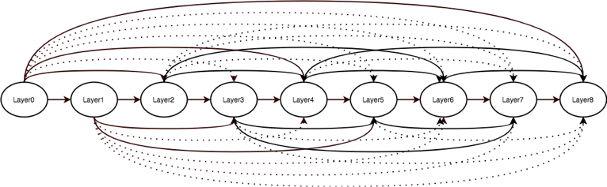

# SparseNet
Sparsely Connected Convolutional Networks

[Ligeng Zhu](https://lzhu.me), [Ruizhi Deng](www.sfu.ca/~ruizhid/), [Greg Mori](http://www.cs.sfu.ca/~mori/), [Ping Tan](https://www.cs.sfu.ca/~pingtan/)

# Current public information
## proposal

## Train Curve
(only trained for 150 iteration. There is a gap to the performance claimed in original work)

