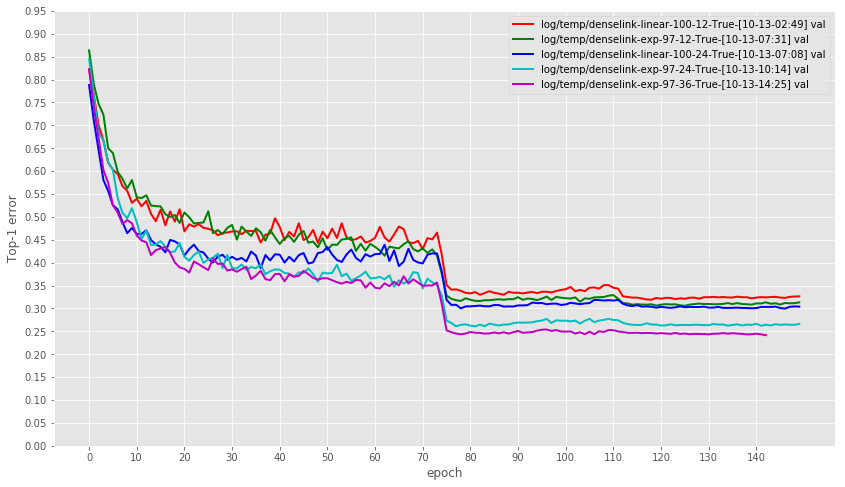

# SparseNet
Sparsely Connected Convolutional Networks
[Ligeng Zhu*](https://lzhu.me), [Ruizhi Deng*](www.sfu.ca/~ruizhid/)

# Current public information
## proposal
## Train Curve
(only trained for 150 iteration. There is a gap to the performance claimed in original work)

